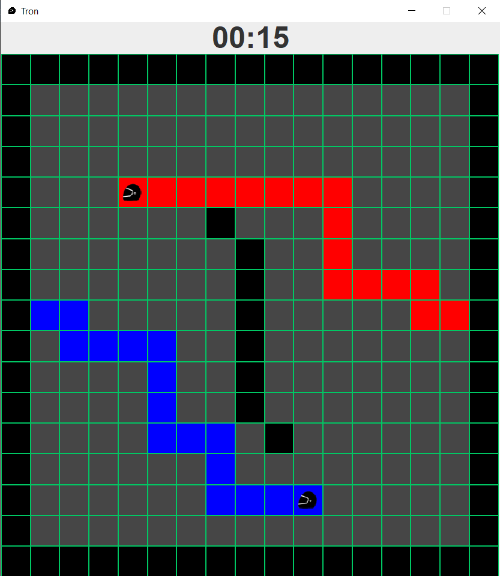

# Tron

## Overview

This repository contains a Java-based implementation of the classic **Tron light cycle duel**, developed as a university project.

The game features:

- **Two-player local multiplayer:** Players compete against each other on a top-down grid.

- **Dynamic Gameplay:** Players control light cycles that leave a trail (light ribbon) behind. The cycles move automatically every second in the last set direction.

- **Win/Loss Conditions**: A player loses if they collide with their opponent's trail or the edge of the game board.

- **Customization:** Players can set their names and choose the color of their light ribbons before starting.

- **Persistent High Scores:** Player wins are tracked in a MySQL database. If a player is not yet in the database, a new entry is created.

- **Leaderboard:** A dedicated menu displays the top 10 players and their scores.

## Contents 

```
.
├── src/
│   └── main/
│       ├── Game.java                 # Entry point 
│       ├── database/                 # MySQL connection and records 
│       │   ├── Highscore.java
│       │   └── HighScores.java
│       ├── model/                    # Game logic and entities
│       │   ├── Direction.java
│       │   ├── GameModel.java
│       │   ├── GameState.java
│       │   ├── Player.java
│       │   └── Tile.java
│       ├── view/                     # Swing UI components 
│       │   ├── GameMenu.java
│       │   ├── GameView.java
│       │   ├── HighScoreMenu.java
│       │   ├── MainMenu.java
│       │   └── PlayerCustomizationPanel.java
│       └── resources/                # Map (.txt) and sprite files
│           ├── helmet.png
│           ├── input1..10.png
│           └── skull.png
└── README.md
```
## Technical Details

The program follows **Object-Oriented Programming (OOP)** principles, with distinct classes for logic and visual representation.

### Core Logic (Model) ###

 - **GameModel:** The engine of the game. It manages the board matrix, the players, and handles the "round" logic.

- **Player:** Represents a player with a name, color, position, and direction.

- **Tile:** Represents a single square on the board, storing its color and safety status.

- **HighScores:** Manages communication with the mySQL database using the Singleton pattern.


### User Interface (View) ###

- **GameView:** The main JFrame that handles switching between different menus (Main Menu, Game Menu, High Score Menu).

- **MainMenu:** A JPanel where players can customize their characters and start the game.

- **GameMenu:** Handles the visual rendering of the game board and processes keyboard input (WASD and Arrow keys).

- **HighScoreMenu:** Displays the leaderboard data in a table format.


## Input Controls

* **Player 1**: `W`, `A`, `S`, `D` keys. 
* **Player 2**: `Arrow Keys` (Up, Down, Left, Right).

## MySQL database

I used this command from NetBeans to create a database wich works with the code.
```
CREATE DATABASE IF NOT EXISTS tron;

USE tron;

CREATE TABLE IF NOT EXISTS highscores (
    id INT NOT NULL AUTO_INCREMENT,
    name VARCHAR(255) NOT NULL,
    score INT NOT NULL,
    PRIMARY KEY (id)
);
```
## Build & Run
The program was created in NetBeans. The main panel of the game appears if the run button is clicked in the IDE.

## Screenshot



